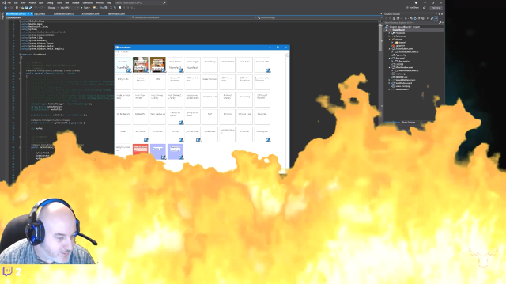

# SoundBoard  
Live Coding Session Built Sound Board App for live streaming sessions.  
Live Coding Session to convert .Net Framework WPF version of app into a .Net Core 3 (Preview) WPF app.  
  
  
  
# Features  
- Global HotKey so even when the app isn't in focus the HotKey will activate the action.
- Can be audio files & green screen video files.
- Can use with any streaming service.
- Built in editor with paste image from clipboard, drag and drop media files.
- Supports plugins.

# How to use Video
1) Create or find a video that has green screen background and add it into your theme.
2) Run the Application.
3) In your streaming software add a window capture/source that targets the running app SubWindow.
4) When you hit the Button or HotKey that has a video then it will play and should appear in your live stream, along with any audio that you may have as well.

# TODO  
- Press and hold button to activate action
- Multi-actions - reorder actions
- Twitter - change name
- Twitter - post tweet about going live.
- Start playing music
- Change theme to profile
- Create tabs to hold actions
- Plugin - play background music
- Plugin - Play sound effect
- Plugin - Play video
- Plugin - Countdown timer
- Plugin - Run PS
- Feature - show timeline builder
